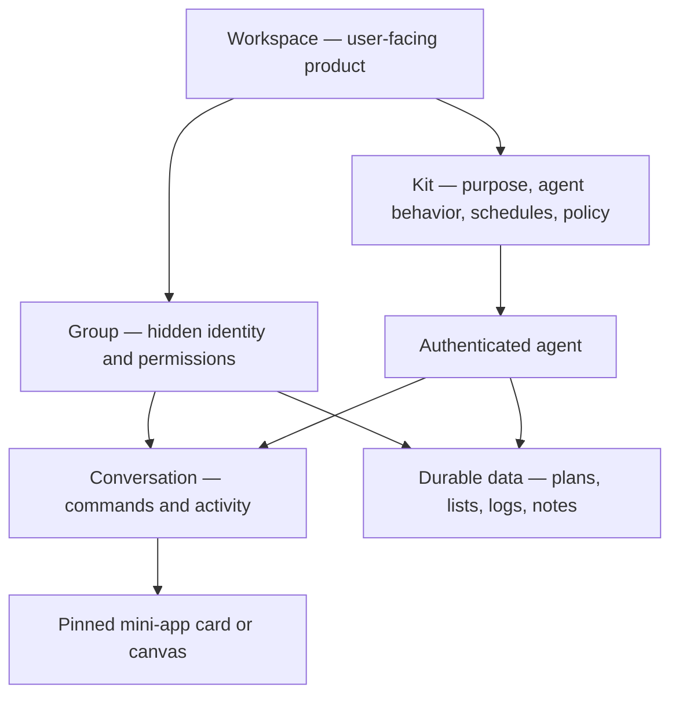

## Recommendation

Make **Workspace** the product primitive and keep **Group** as the hidden infrastructure.

The external promise is:

> Describe a useful little app, invite the people it’s for, and your agent builds and runs it in a private space that remembers.

That is “Repl.it for normies” without exposing code, deployment, databases, channels, or model configuration.

## What the codebase supports

The foundations are stronger than the current UI suggests:

| Capability | Status |
|---|---|
| Authenticated people and agents sharing a private space | Shipping |
| Membership, invitations, roles, and permissions | Shipping |
| Durable conversations and shared notes | Shipping |
| Task-specific agent sessions per channel | Shipping |
| Scheduled agent work | Shipping, but not activation-friendly |
| Installable workspace behaviors/templates | Strong unmerged “kits” prototype |
| Declarative interactive cards | Shipping but limited |
| Arbitrary generated mini-app UI | Research prototype only |
| Workspace-first product IA | Missing |

Groups already provide the correct security and social substrate: hosted membership, roles, permissions, invitations, and secret spaces. Deleting that backend construct would throw away the main differentiated capability. [Backend group architecture](</Volumes/External/dev/worktrees/tlon-apps/epic-nash-12c465/docs/backend/desk/app/groups.md:1>)

The backend also supports third-party channel agents, so a future mini-app can have its own data model without being forced into chat posts. [Generic channel-host routing](</Volumes/External/dev/worktrees/tlon-apps/epic-nash-12c465/desk/app/groups.hoon:624>) Notes already demonstrate this pattern and inherit group permissions. [Notes channel creation](</Volumes/External/dev/worktrees/tlon-apps/epic-nash-12c465/packages/shared/src/store/channelActions.ts:119>)

The main problem is the frontend framing. Home is still organized around “All / Groups / Messages,” group screens expose a channel list, and creating something means “new group chat.” [Current home tabs](</Volumes/External/dev/worktrees/tlon-apps/epic-nash-12c465/packages/app/features/chat-list/ChatListTabs.tsx:12>) [Current group screen](</Volumes/External/dev/worktrees/tlon-apps/epic-nash-12c465/packages/app/ui/components/GroupChannelsScreenView.tsx:313>)

The existing onboarding similarly exposes too much product machinery: bot identity, provider, model, group, and invitation spread across many panes with substantial component state. [Current onboarding sequence](</Volumes/External/dev/worktrees/tlon-apps/epic-nash-12c465/packages/app/ui/components/Wayfinding/SplashSequence.tsx:104>)

## Proposed product model

A workspace should consist of:

- A secret group providing membership and authorization.
- The user’s agent as an explicit authenticated member.
- One primary conversation with a stable task-specific agent session. The OpenClaw routing already gives group channels stable independent sessions. [Agent session routing](</Volumes/External/dev/worktrees/tlon-apps/epic-nash-12c465/packages/openclaw/src/session-route.ts:29>)
- One durable artifact store, initially `%notes`.
- A workspace descriptor stored in the forthcoming group blob: kit identity, agent identities, named places, setup status, schedules, and permissions.
- A pinned app-shaped surface summarizing the current state.

Users should never need to understand that “Discussion” and “Meal Plan” are channels. They are simply views inside the workspace.

Existing social groups can remain as Communities or Chats. Only groups carrying the workspace descriptor should receive the new app-shaped treatment, avoiding a disruptive migration.

## Onboarding: two interstitials, then value

### Screen 1: “What should this space do?”

Offer three concrete shared starters:

- Weekly meals and grocery list — recommended first wedge.
- Garden plan and shared reminders.
- Household tasks and recurring routines.

Include “Something else,” but do not make an open-ended interview the primary path.

Meal planning is the strongest first activation case: it is immediately generative, naturally collaborative, produces a visible durable artifact, and supports recurring behavior without depending on integrations.

### Screen 2: “Who is this for?”

Let the user invite a partner or housemate, or continue alone.

This screen should carry the differentiation succinctly:

- Only these people and their agent can access the workspace.
- The history and plans stay in their private data store.
- Changing the underlying AI model does not erase the workspace.

Provision the group, notes space, agent seating, and starter kit while the user is on these screens. Bot naming, avatar, provider, model, and connected services move to settings or later contextual prompts.

### Chat landing

Land directly in the real workspace conversation with:

1. A starter artifact already visible.
2. One meaningful action the user can take immediately.
3. Live task rows showing “Drafting plan → Saving grocery list → Ready.”
4. A completed artifact within a target of 90 seconds.
5. The recurring schedule offered only after the first result.

The codebase already uses a shared gardening conversation in onboarding, so this domestic framing is consistent with the direction already emerging. [Garden preview](</Volumes/External/dev/worktrees/tlon-apps/epic-nash-12c465/packages/app/ui/components/Wayfinding/BotChatPreview/mockConversation.ts:12>)

## Fixing interactive state

Your proposed fix is correct: the bot message must be the source of truth.

The current A2UI model attaches a surface to one post and does not update earlier surfaces. Frontend edit paths also preserve the previous blob. [A2UI limitations](</Volumes/External/dev/worktrees/tlon-apps/epic-nash-12c465/docs/tlon-apps/post-blobs.md:84>) However, the underlying post-edit transport already accepts a replacement blob. [Post edit transport](</Volumes/External/dev/worktrees/tlon-apps/epic-nash-12c465/packages/api/src/client/postsApi.ts:221>)

The new interaction protocol should be:

1. Every interactive message has a stable surface ID, revision, current state, and processed action IDs.
2. A tap emits an action referencing the original message and expected revision.
3. The agent validates the actor against workspace permissions.
4. The agent edits its original message with the new state and incremented revision.
5. Every device re-renders from the synchronized post.
6. React state is used only for short optimistic feedback, then reconciled against the message.

This handles app restarts, virtualization, multiple devices, and multiple participants. It requires extending the agent’s post-edit tooling to write blobs; the current CLI edit path only edits message text.

## Reuse the prototype work selectively

The unmerged branches already divide naturally into product layers:

- `cron-prompt-onboarding` and `agent-onboarding-v2`: retain the provisioning, recovery, trusted-agent, and telemetry work. Discard the conversational wizard and session-only UI state.
- Kits work (`0f5ebfc28`, `12c2ae54b`): make this the foundation. It already models behavior packages, abstract places, schedules, setup, policy, group-blob configuration, installation, and sharing.
- Mini-app demo (`385fbe9f0`): retain the action-log/reducer/render mental model, but do not make client-executed JavaScript bundles the MVP. It needs a stronger signing, permissions, sandboxing, upgrade, and recovery story.
- Agent task rows (`6ee72347e`): use this immediately for the post-onboarding engagement hook.

The current renderer architecture is ready for extension conceptually, but its channel types and component registry are still closed and hard-coded. [Closed channel types](</Volumes/External/dev/worktrees/tlon-apps/epic-nash-12c465/packages/api/src/types/models.ts:46>) [Static renderer registry](</Volumes/External/dev/worktrees/tlon-apps/epic-nash-12c465/packages/app/ui/contexts/componentsKits/ComponentsKitProvider.tsx:28>)

## Rollout plan

### 1. Capability and wedge decision

Run the proposed team exercise, but capture each idea in a matrix:

- User job
- People or agents involved
- Required authenticated action
- Durable data produced
- Trigger: tap, message, event, or schedule
- Possible today?
- Missing dependency

Cross off anything requiring arbitrary generated UI, unsupported integrations, or unclear permissions. Cluster what remains into templates and select one shared-domestic hero.

### 2. Activation milestone

Ship:

- Two interstitials.
- One meal-planning workspace kit.
- Immediate starter artifact.
- Server-authoritative edited cards.
- Task-progress rows.
- Contextual invitation after the first result.
- Instrumentation for time to workspace, first action, first artifact, and invitation.

### 3. Workspace IA milestone

Replace the core navigation with:

- Workspaces
- Inbox
- People

Workspace home cards should show the artifact summary, collaborators, agent status, and next scheduled action—not the latest chat line. Inside a workspace, show the app surface first and conversation second. Hide the raw channel list unless advanced management is needed.

### 4. Platform milestone

Then harden the broader builder:

- Promote Kits into the supported workspace-template format.
- Open the renderer registry with graceful fallback for unknown views.
- Add a dedicated third-party app channel for structured state where Notes is insufficient.
- Add signed, publisher-pinned kit versions and explicit capability grants.
- Build action replay, snapshots, upgrades, and recovery before allowing arbitrary mini-app code.

Local SQLite should remain a cache, not the durable workspace store; the app’s queries only refresh through explicit invalidation. [Local data architecture](</Volumes/External/dev/worktrees/tlon-apps/epic-nash-12c465/docs/tlon-apps/db-react-query.md:14>)

## Galen’s live iOS review

Run this on a fresh physical iPhone with screen mirroring and a second real account:

- Kill and reopen after each interstitial.
- Background the app while provisioning.
- Tap an action twice and confirm it remains idempotent.
- Open the same card on a second device and confirm identical state.
- Create, share, accept, and collaborate in the workspace.
- Confirm the first durable artifact appears in under 90 seconds.
- Schedule a test follow-up a few minutes later rather than waiting until the next morning.

The decisive product test is not whether onboarding completes. It is whether Galen can say, within two minutes: “We now have a useful shared thing, it remembers, and the agent is already doing work inside it.”

The shortest path is therefore: **workspace IA + kits + immediate durable artifact**, with the group system hidden underneath. The generalized AI mini-app runtime comes after that loop proves compelling.