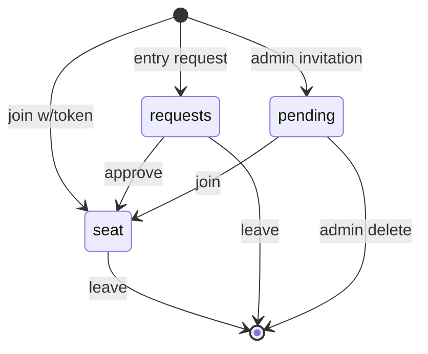
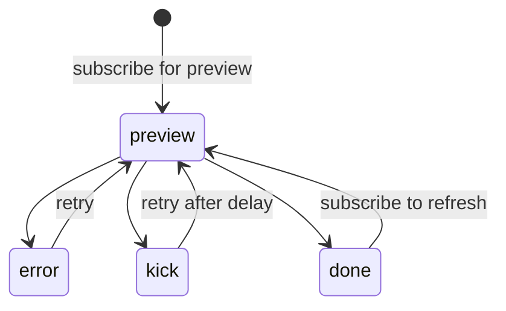
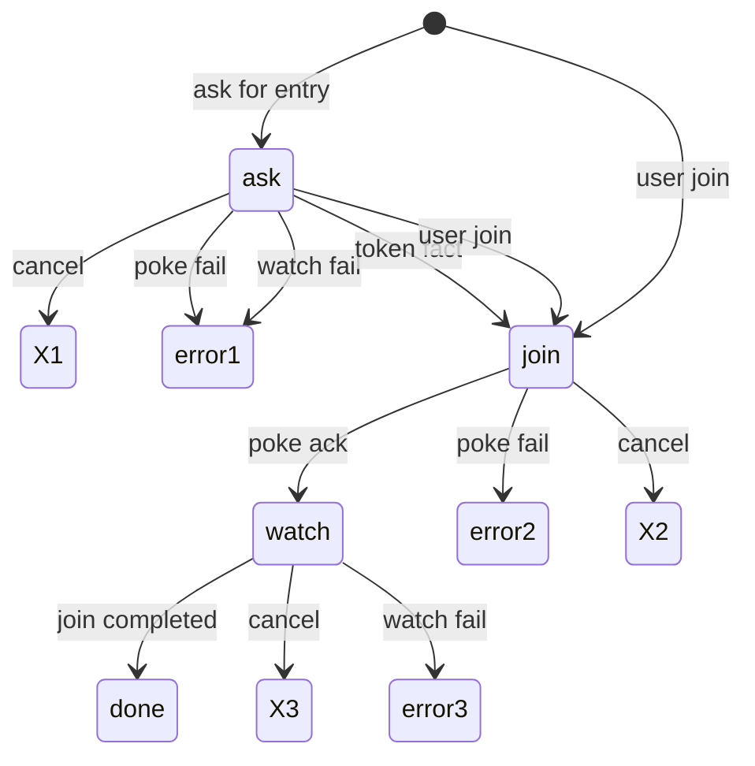
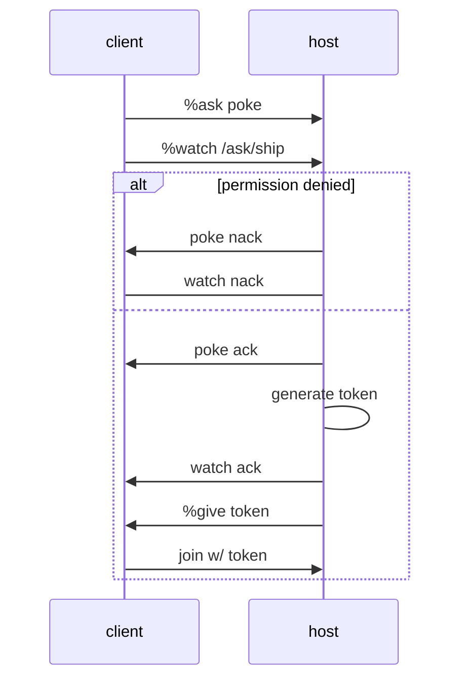
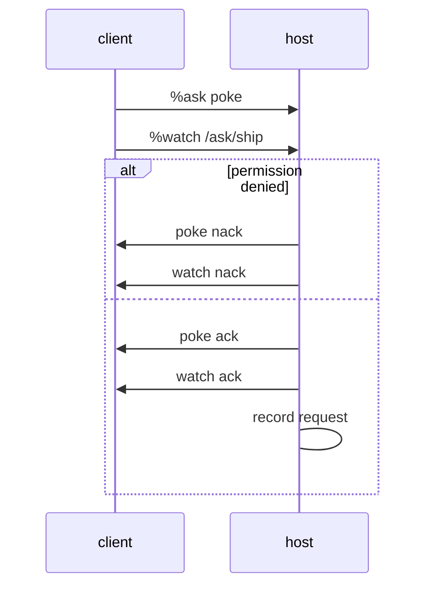
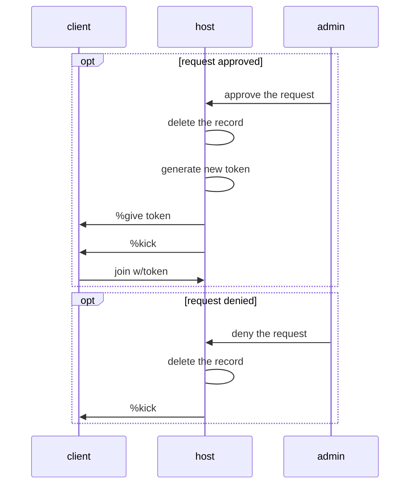
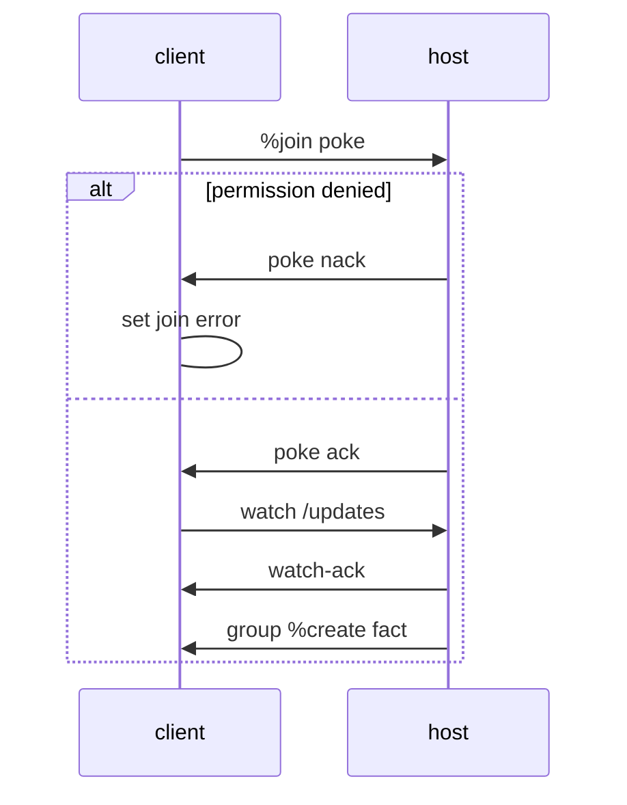
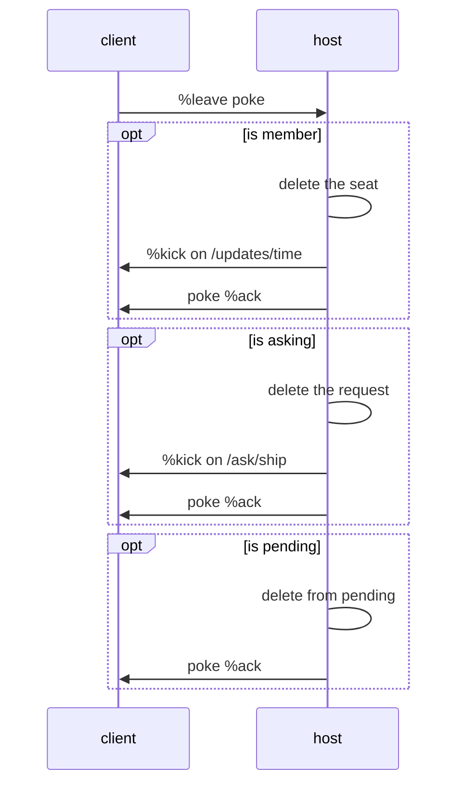
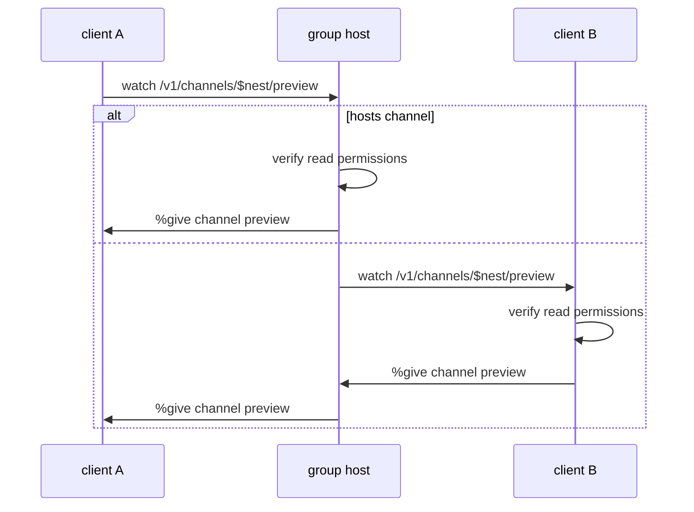

# 1 Overview
The groups gall agent hosts and manages groups. Groups are a social networking primitive and comprise a collection of channels accessible by group members together with various group and channels metadata, including permissions. Group members can be assigned roles with differing access to group resources. A user can become a group member by receiving an invitation or requesting entry, depending on group privacy settings.

A group can also be previewed without joining it, to obtain basic information about a group such as the group metadata containing title, description and icon, the number of group members and privacy settings. This function is used as a discoverability feature.

Only public and private groups can be previewed. Secret groups remain hidden and can only be seen only by invited members.

# 2 Architecture
The groups agent is comprised of two separate cores : the server core `+se-core` and the client core `+go-core`. Thus, the agent state contains both the state of hosted and subscribed groups, which are distinguished by a flag. Combining the server and subscriber functions in one agent saves us some complexity associated with running two separate agents and is possible because the server and subscriber state differs only minimally and the surrounding logic can be separated out without too much effort.

However, care must still be taken when managing the groups state, which in the case of self-hosted groups is shared between the server component `+se-core` and the local client component `+go-core`; the group host uses the client component to internally join its own group.
In particular, this means that when an updated is processed by the group host, `+go-core` must appropriately short-circuit logic that has already been applied in the server component, taking care at the same time to generate client-related logic, such as generating notifications or sending responses to subscribers.

In addition to the group server and client cores, there is also the foreign group core `+fi-core`. This core manages state associated with querying and joining groups of which we are not a member yet – hence the name foreign.

# 3 Group membership
The group host keeps a record of all member ships as a collection of seats. Each `$seat` carries with it information about the assigned roles and a join timestamp. Roles determine permissions to access channels contained in a group. A special role `%admin` designates admin group members, who have permissions to administer the group.

## 3.1 Joining a group
The following diagram shows the lifecycle of a group member. Before a user joins a group, he must obtain an invitation, which carries an access `$token`, or request for entry. A ship can also be added to the group's pending list, which contains ships to be granted entry upon confirmation, together with associated roles.

As such, the group host keeps a record of ships in three different places:
1. The set of pending ships. Adding a ship to the pending list automatically generates an invitation and sends it. In addition, the pending entry can be associated with a set of roles. When the ship joins the group, it is automatically granted the recorded roles.
2. The set of requesting ships. When a ship requests to join the group, it is recorded in the requesting set. An admin member can then grant or deny this request. If the request is granted, the requesting ship will receive an invitation and join the group automatically.
3. The set of members. Ships which have successfully obtained entry, either via an invitation or an entry request, are recorded in the group seats record. This record persists until a group leaves, or is removed from the group.
## 3.2 Revoking group membership
In addition to a group member leaving the group on their own, an admin can also remove an unwanted group member from the group by kicking them out. However, this does not prevent the removed group member from attempting to join again. See the below section.
## 3.3 Group banned list
The group host also maintains a list of banned ships and banned ranks. When a ship is banned, it is automatically kicked from the group, if it is yet a member. Furthermore, a banned ship can not interact with the group in any way: all operations will result in permission denied error. 

The same applies to rank-based ban list. Banning moons from a group would firstly kick-out all existing moon-class members, while also prohibiting any future interactions.
# 4 Foreign groups

A foreign group is a group that we possess some information about, but that we are not a full member of yet. 
## 4.1 Previewing a group 
A minimal information we can have about a group, apart from knowing its existence, is a group preview. Obtaining a group preview is non-obligatory – we might want to preview groups we have no intention no join. A group preview can be requested of public and private groups without any permissions, while previewing a secret group requires a valid access token.

The following diagram illustrates the group preview state machine.

## 4.2 Joining a group
There are two ways to join a group: we can ask the group host for entry, or we can attempt to join directly, possibly with an access token. A successful entry request yields a group access token received from the host, that is then automatically used to join the group.

A group join internally has two stages: in the first stage we poke the group host with access token. If successful, we are granted a seat in the group. At that point, control over the group is transferred from the foreign core `+fi-core` to the group core `+go-core`. Subsequently, we subscribe to the group host on two paths: general update path, and a ship specific update path that is used to communicate facts not meant for everyone (such as admin-only facts, or personal tokens sent only to the requester).

# 5 Group joins

As mentioned in the section on Foreign Groups, there are two ways in which a ship can become a group member. The first one is to directly issue a join request to the group with appropriate access token. (Public groups allows joins with an empty token.) The second one is to request entry using group ask request.

The following state diagram illustrates these two pathways to join a group, including various error conditions that can occur.

# 6 Group sequences
In this section we discuss the most important group flows using sequence diagrams. While some of those have been presented in the preceding sections using state diagrams, state diagrams contain only local information, and as such do not give the full picture of a given flow. Here sequence diagrams complete the picture, illustrating illustrating the communication between involved parties.
## 6.1 Ask request
### Public group ask
An ask request issued to a public group is automatically approved, unless the client has been banned. The group host generates a new invite token and sends it to the client, which then proceeds to join the group with the received access token.

### Private group ask
An ask request issued to a private group is recorded in `requests.admissions`, unless the ship has been banned. Group admins can then approve or deny requests. For an approved request, the group host issues a token that is then send to the client. The client then uses the token to join the group. If an ask request has been denied, the group host notifies the client by kicking his subscription, which terminates the flow at the client side.

#### Client ask

#### Admin approve and deny

## 6.2 Group join
When a ship joins a group, it sends a poke containing an access token. If the token is valid, the group host will send-back standard poke-ack. If the token is not valid, the group host will crash, which terminates the join sequence with an error.

When poke-ack has been successfully received by the joining ship, it then initiates a subscription to the group, and receives the first data payload from the group host, completing the process.

## 6.3 Group leave
A client agent is in some way registered by the group host in the following cases: (1) he is already a group member, (2) he is in the process of joining the group and has a registered seat, (3) he has issued a group ask request, (4) he has been added to the pending list.

If the client then wishes to forfeit that registration, he can issue a group leave request. The group host will then de-register the client from all existing records. In particular, the host will do the following.
1. Delete the client's seat and kicks any outstanding group subscriptions.
2. Delete the client hosted channels.
3. Delete the client's ask request and kicks any outstanding ask subscriptions.
4. Delete the the client from the pending list.

## 6.4 Channel previews
Channel previews carry the metadata of a channel, together with the associated group preview. _Q: can a channel belong to two groups at once? Do we guard against it?_
This is useful because in some contexts our starting point are the channels, which do not, by themselves, carry associated group information. Imagine we want to display a list of channels that have unread notifications. We know their identity, but on the display list we would also like to show the owning group icon etc. A channel preview enables us to store all required information in one place, and resolve it, if it is yet missing.

